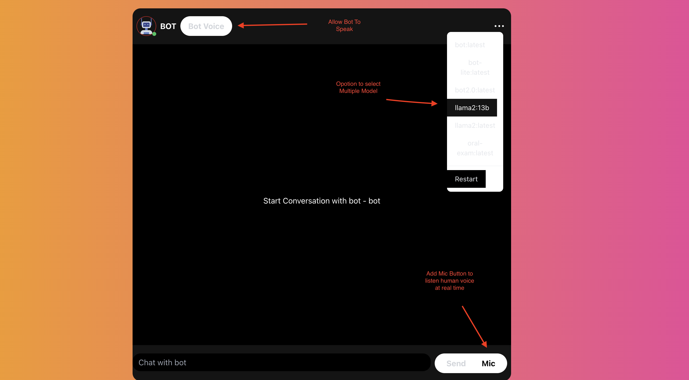

# Textbase Bot UI

## Project Overview
This repository contains the user interface (UI) for the Textbase Bot project. Textbase Bot is an innovative chatbot that can understand and respond to text-based queries. The UI serves as the frontend for interacting with the bot.

## Setup Instructions

### Prerequisites
- Node.js installed on your local machine.

### Installation
1. Clone this repository to your local machine using the following command:
   ```shell
   git clone git@github.com:alex8430/textbase-bot.git

## Setup Instructions

### Prerequisites
- Node.js installed on your local machine.

### Installation

1. **Install Dependency:**
   ```shell
   cd textbase-bot
   npm install

2. **Running Locally:**
   ```shell
   npm start 

### Chat Bot Backend

1. Clone the backend repository to your local machine using the following command:
   ```sell
   git clone git@github.com:alex8430/chat-bot-backend.git
2. pass backend endpoint in query params 
   ```sell
   ?API_URL=http://localhost:<port>

## Screenshots

**Screenshot 1:**

*Walkthrough of UI*
1. There is ... setting button when we click on that is dropdown open and there is a list of model that we get from backend we can switch our llm model
2. Mic button to start voice recognition to give command to bot.
3. Bot Voice. allow bot to speak it is a toggle button


## Demo Video

[Watch the Textbase Bot UI in action on YouTube](https://www.youtube.com/watch?v=gQNaDvKSldU)


